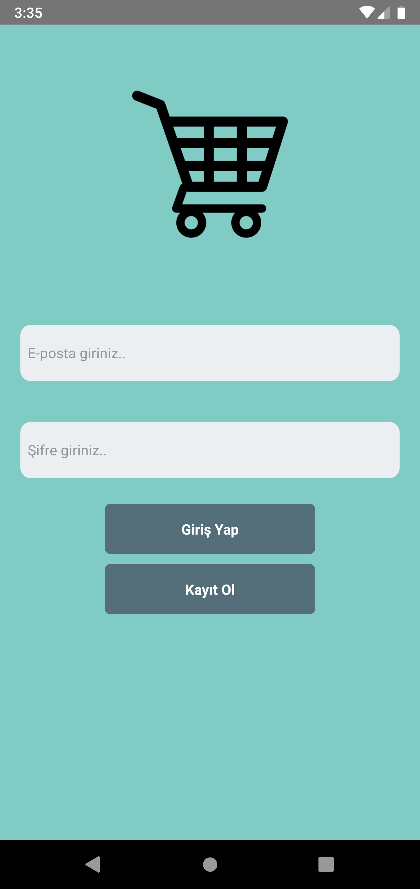

# React Native Portfolio Building

Purpose of the this portfolio building training is to teach the students how to use components and styling structure of React Native

## Learning Outcomes

At the end of the this hands-on training, students will be able to;

- Understand components structure

- Understand styling basics

## Outline

- Part 1 - Components

- Part 2 - Styling

- 

- 

## Happy Coding!

